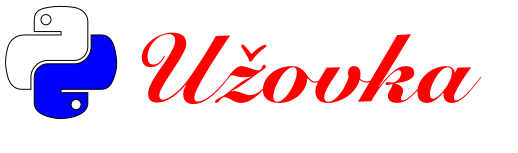

# 🐍 Užovka - slovenské programovacie nárečie! 🐍

Vitajťe, milí priateľja programovaňja! Užovka je programovacie nárečie podobné Pitónu, ale v šatách slovenskích, štúrovskích. Preložili sme moderné sintaksi do reči našich predkov, abi všetko znelo ako kebi [sťa] z pera samotného Ľudevíta Štúra, alebo tak dajako.

## Čo je Užovka?

Užovka je programovacie nárečie. Ak viete písať v nárečí Pitón, tak budete jednoducho vedijeť písať aj v nárečí Užovka. Keďže máte lásku k Štúrovi a zároveň radi kódíte, Užovka je pre vás ako stvorená! Všetki funkcije, operátori a vírazi sú stvorené do jednej staroslovenskej krási.

## Jak sa to inštaluje?

Najprv skopírujte zdrojoví kód Užovki:

```bash
git clone https://github.com/tzatko/Užovka.git
cd Užovka
```

Teraz viskúšajťe spustiť vaše programi v Užovke s príkazom:
```
./užovka súbor.🐍s
```

# Príklad kódu v Užovke
Pozrime sa na jednoduchý príklad programu v Užovke, kde vipíšeme pozdrav:

```
# Ustanovenie funkcije, čo vipíše pozdrav
ustanoviť pozdrav():
    vipísať("Ahoj, svet!")

# Hlavní program
keďbi __meno__ rovnje "__hlavné__":
    pozdrav()
```
Jednoduchšja verzija je napísaná v súbore `ahojsvet.🐍`
Ďaľším praktickím príkladom je program v súbore `eratosthenes.🐍`. Ten vie spočítať prvích en prvočísel. Také pánske huncútstvo.

Všimnime si, že namiesto `def` máme `ustanoviť`, namiesto `print` máme `vipísať`, a takto ďaľej. Váš kód teraz znie ako rozprava v reči slovenkej!

# Klúčové slová v Užovke
Užovka má svoje vlastné verzije známich Pitónovskích kľúčovích slov, napríklad:

| Užovka         | Pitón  |
|----------------|--------|
| ustanoviť      | def    |
| vipísať        | print  |
| navráťiť       | return |
| pravďivuo      | True   |
| nepravďivuo    | False  |
| ňič            | None   |
| sčítať         | +      |
| odčítať        | -      |
| násobňe        | *      |
| děliť          | //     |

Všetki slová prirovnané ku Pitónovím slovám sú zapísané v súbore `nárečja.čoh` a ako prípona súboru narieka, je to zapísané vo formáťe čiarkou odďelené hodnoti.

# Jak funguje prostredie vikonávaňia Užovki?
Prostredie vikonávaňia zaťjaľ funguje pomocou čara, čo všetki .🐍 súbori najskôr preloží do .pitón súborov a spustí ich cez vikonávač Pitónu. Užovka potom po sebe vičistí pitónové súbori – po skončeňí všetko čo je naviše zmizne ako dim!

```
./užovka noví_program.🐍
```

# Prispievajťe do Užovki
Máťe nové nápadi na zľepšenie vikonávacieho prostredia? Chcete zľepšiť nárečia a pridať nové kľúčové slová? Raďi privítame každého, kto bi rád prispel k slovnej zásobe Užovki! 

Našim vzňešením cieľom je dosiahnúť abi služobníctva vládi slovenskej Užovku užívali ako preferované nárečie pri tvorbe nového softvéru v štátnej správe.

# Dovolenije
Nie sme veru mi žiadňi fiškáli, ale bi sme použiľi GNU VVD - Všeobecné verejné dovoľeňije. Ňevjem ktorej verzije [:smutnik:].

# Slovo kurátora k obrázku
*Autor simboľicki viužíva farbi trikolóri spolu s vhodním víberom fontu ako referencije na slovenskí ľudoví puovod nárečia už z čias Ľudevíta Štúra. Sám Hurban sa o nárečí vijadril, citujem "Ci Pána, to ťi je janovô!". Hodža smaotné nárečie komentoval ako "Ja už v inôm písať aňi nedokážem.. žena mi to logo aj na košuľku višila, aha..." (ukazuje na obrázok višití krížikovím stehom na svojej konopnej košuľke)*

# Inšpirácia a odporúčaňja na iné zaujímavé projekťi

Toto programovacje nárečje bolo inšpirované i projektami tímito:

* [OSTRAJava](https://github.com/tkohout/OSTRAJava)
* [BRA Recursive Acronym](https://github.com/tzatko/BRA)
